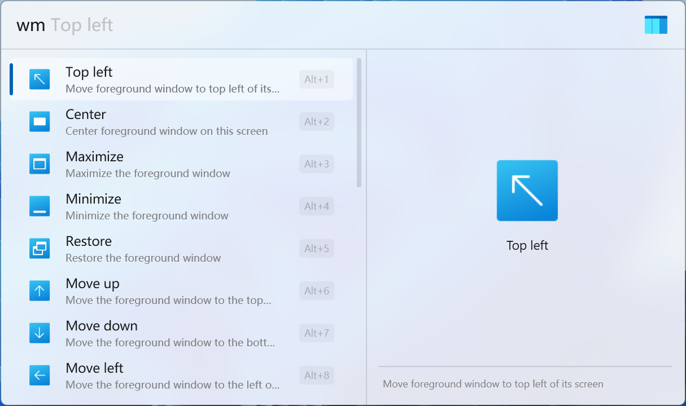
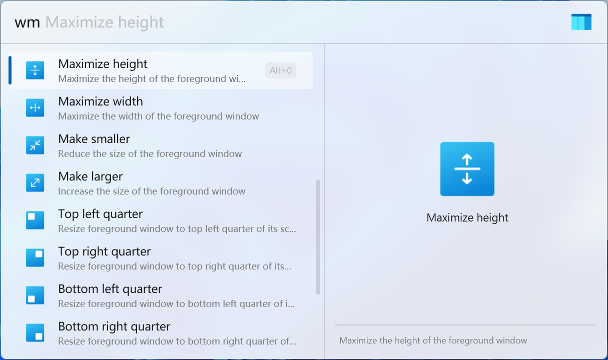

  

# Flow Launcher Window Manager Plugin

**This plugin is a clipboard manager for [Flow Launcher](https://github.com/Flow-Launcher/Flow.Launcher). It can help you move and resize application windows.**

## ⭐ Features

- Move window to the top left of the screen
- Center window on the screen
- Minimize / Maximize / Restore windows
- Move windows to the left / right / top / bottom of the screen
- Maximize height / width of the windows
- Make windows smaller / larger
- Resize windows to half / quarter of the screen
- Move windows to the next / previous screen

## 🖼️ Screenshots

<picture>
  <source media="(prefers-color-scheme: dark)" srcset="./images/screenshot1_dark.png">
  <source media="(prefers-color-scheme: light)" srcset="./images/screenshot1_light.png">
  
</picture>

<picture>
  <source media="(prefers-color-scheme: dark)" srcset="./images/screenshot2_dark.png">
  <source media="(prefers-color-scheme: light)" srcset="./images/screenshot2_light.png">
  
</picture>

## 🚀 Installation

* Plugin Store (Recommended)

  1. Search `Window Manager` in Flow Launcher Plugin Store and install

* Manually Release

  1. Downlaod zip file from [Release](https://github.com/Jack251970/Flow.Launcher.Plugin.WindowManager/releases)
  2. Unzip the release zip file
  3. Place the released contents in your `%appdata%/FlowLauncher/Plugins` folder and **restart** Flow Launcher

* Manually Build

  1. Clone the repository
  2. Run `build.ps1` or `build.sh` to publish the plugin in `.dist` folder
  3. Unzip the release zip file
  4. Place the released contents in your `%appdata%/FlowLauncher/Plugins` folder and **restart** Flow Launcher

## 📝 Usage

### 0. Set Action Keyword

The default action keyword is `wm`, you can change it in the Flow Launcher.

### 1. Config Administrator Mode (Optional)

This plugin requires administrator privileges to:

* Move and resize elevated windows

For full functionality, we recommend running Flow Launcher as administrator during automatic launches:

* Exit Flow Launcher
* Run Flow Launcher as administrator
* Open setting window and navigate to `General` page
* Enable `Use logon task instead of task entry for faster startup experience`
* Disable `Start Flow Launcher on system startup`
* Enable `Start Flow Launcher on system startup`

Then we can verify if it succeeded:

* Open `Task Scheduler`
* Find the logon task with name `Flow.Launcher Startup`
* Check if `Security options` -> `Run with highest privileges` is on

> [!WARNING]
> Running as administrator may launch other applications with elevated privileges without UAC prompts.
> So please use this with caution.

### 2. Uninstall Programs

Use the action keyword to search for commands in Flow Launcher and click any result to execute it.

## 📚 Reference

- [ICONS](https://icons8.com/icons)
- [ClipboardPlus](https://github.com/Jack251970/Flow.Launcher.Plugin.ClipboardPlus)
- [Raycast](https://www.raycast.com/core-features/window-management)
- [fluentui-system-icons](https://github.com/microsoft/fluentui-system-icons)

## 📄 License

[Apache License V2.0](LICENSE)
